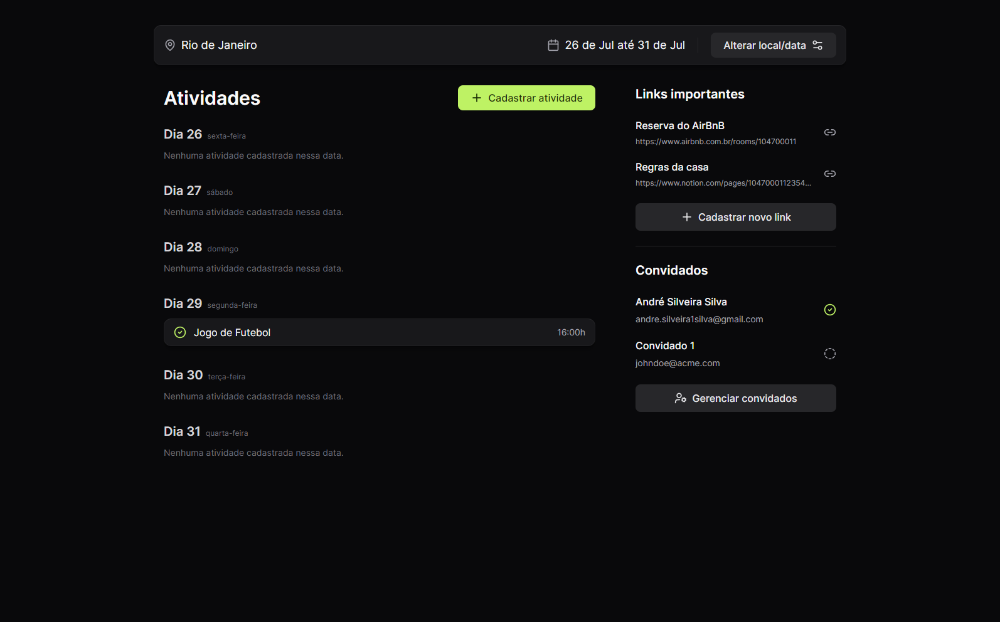

<h1 align="center">Plann.er</h1>

<h2 align="center">Plan a trip with your friends!</h2>

<p align="center">Project created with Vite, ReactJS and TypeScript.</p>




## Features

- [x] Create a trip
- [x] Invite participants
- [x] Send an email to confirm participation
- [x] A dashboard to register activities
- [ ] Guest management
- [ ] Important links

## For run

NPM

```bash
npm install
npm run dev
```

YARN

```bash
yarn
yarn dev
```
